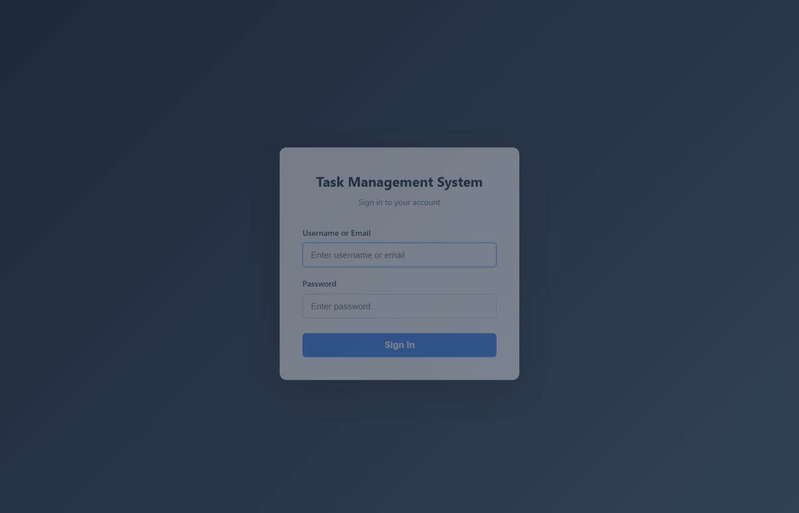
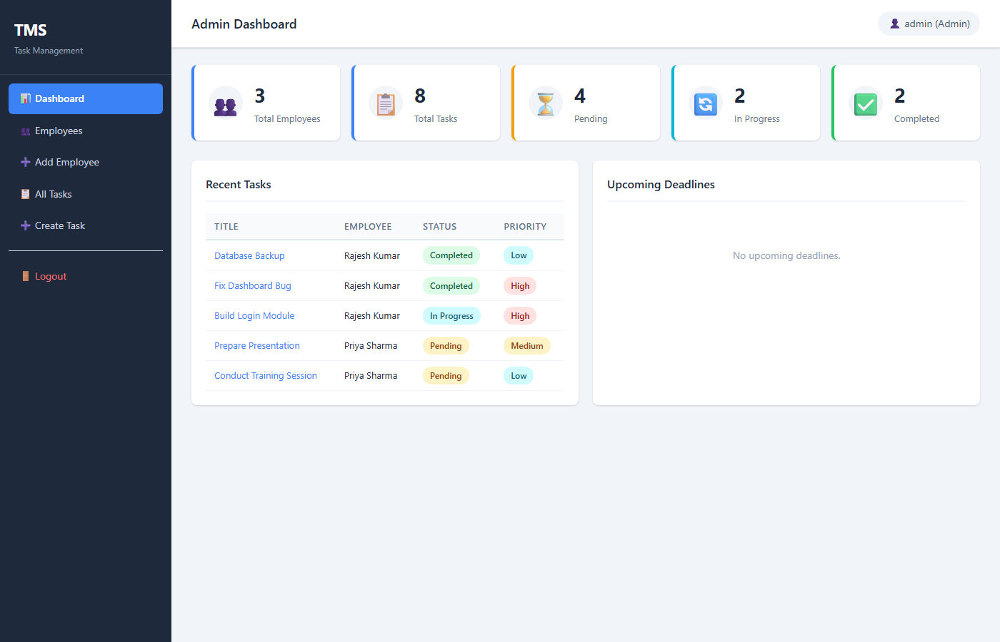
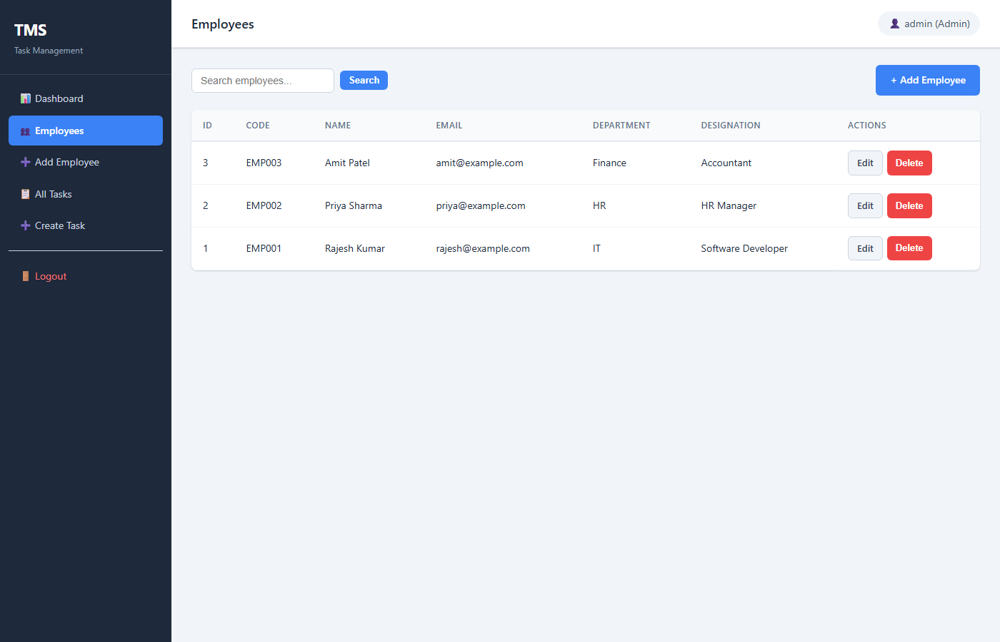
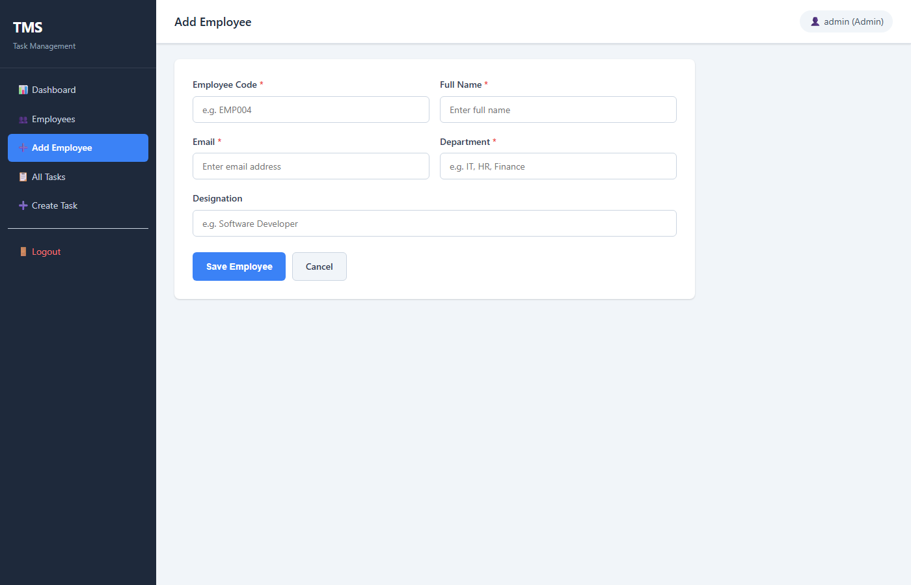
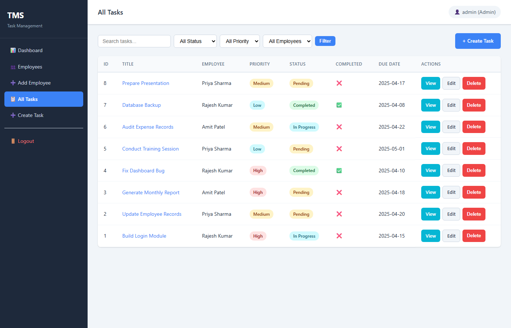
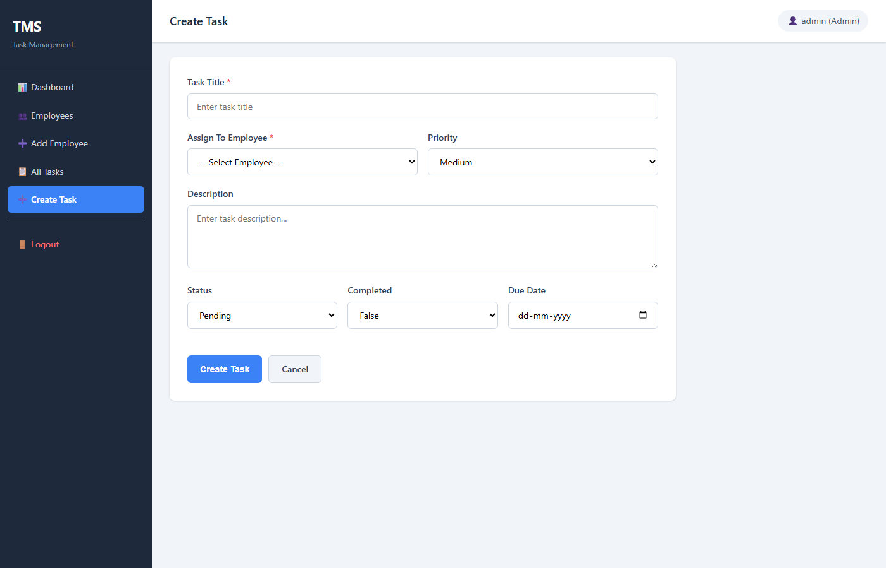
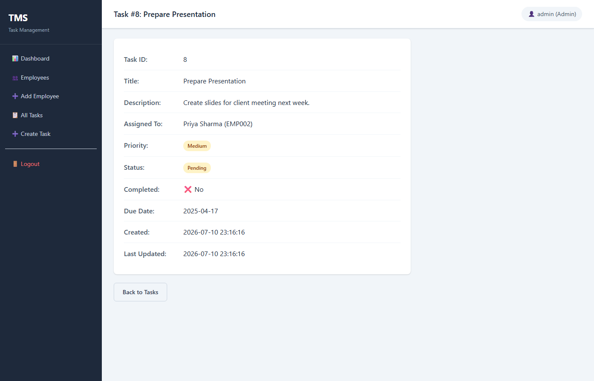
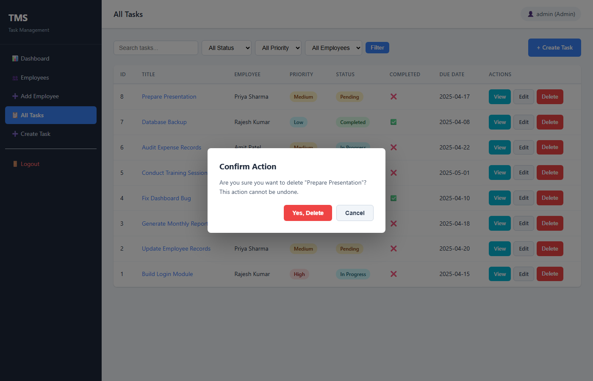
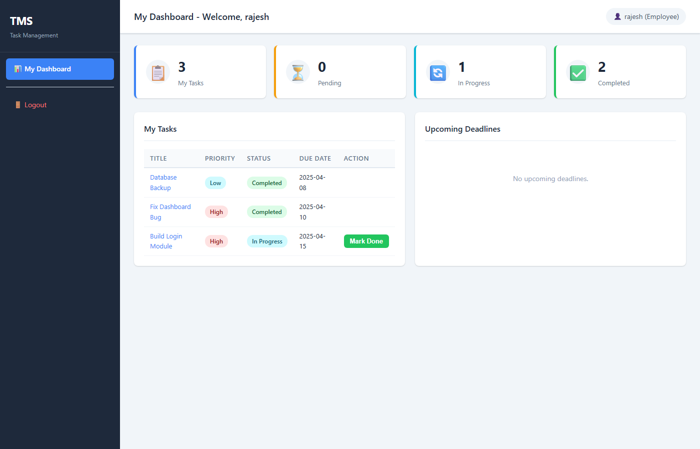
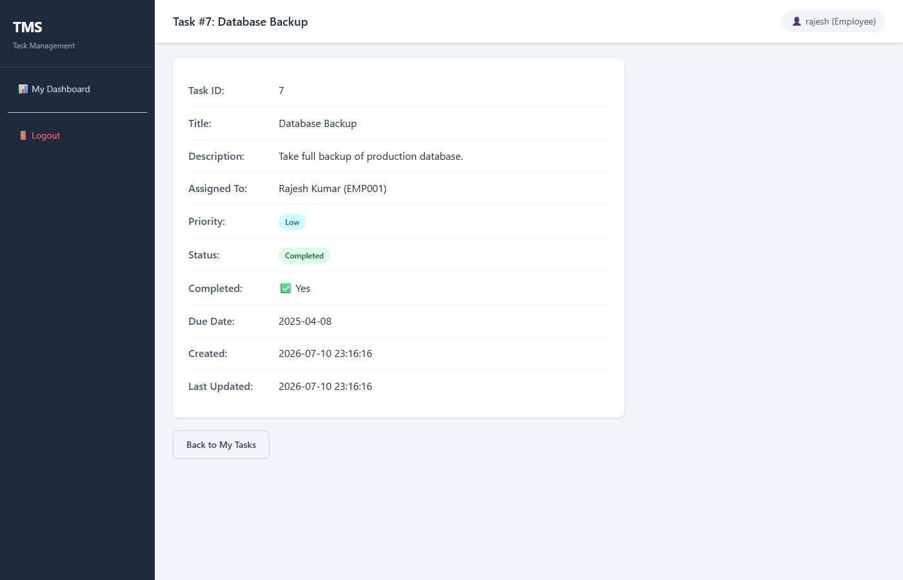

# TASK MANAGEMENT SYSTEM

### A Web-Based Task Management Application Using Flask & MySQL

## TABLE OF CONTENTS

1. [Abstract](#abstract)
2. [Scope of the Project](#scope-of-the-project)
3. [Technology Stack](#technology-stack)
4. [System Architecture](#system-architecture)
5. [Database Design](#database-design)
6. [Data Flow Diagram](#data-flow-diagram)
7. [Folder Structure](#folder-structure)
8. [Installation & Setup Guide](#installation--setup-guide)
9. [How to Use the Application](#how-to-use-the-application)
10. [Default Demo Credentials](#default-demo-credentials)
11. [Screenshots](#screenshots)
12. [Testing & Validation](#testing--validation)
13. [Conclusion](#conclusion)

---

## ABSTRACT

The **Task Management System** is a full-stack web application designed to streamline the process of assigning, tracking, and managing tasks within an organization. Built using a classic three-tier architecture, the system separates the **Presentation Layer** (HTML5, CSS3, JavaScript), **Application Layer** (Python Flask), and **Data Layer** (MySQL).

The system implements **two user roles** — **Admin** (Manager) and **Employee** — each with distinct permissions. The Admin can manage employee records and create/assign/edit/delete tasks. Employees can log in to view only their assigned tasks and update task status. All passwords are stored as **salted hashes**.

---
## SCOPE OF THE PROJECT

**In Scope:**

- User authentication (Login / Logout)
- Admin dashboard with summary statistics
- Employee management (Add, Edit, Delete, Search)
- Task management (Create, Assign, View, Edit, Delete, Status Update)
- Task filtering by status, priority, and employee
- Employee personal dashboard with their tasks only
- Responsive web UI usable on desktop and tablet
- Delete confirmation modals, toast notifications, form validation

---

## TECHNOLOGY STACK

| **Layer**        | **Technology**                          | **Purpose**                                |
|------------------|-----------------------------------------|--------------------------------------------|
| Frontend         | HTML5, CSS3, Vanilla JavaScript         | User interface, styling, client-side logic |
| Backend          | Python 3.13 + Flask 3.1                 | Server-side routing, business logic, auth  |
| Database         | MySQL 8.0                               | Persistent data storage                    |
| Database Driver  | mysql-connector-python 9.7              | Python-to-MySQL communication              |
| Password Hashing | Werkzeug 3.1 (generate_password_hash)   | Secure password storage                    |
| Environment      | python-dotenv                           | Loading config from .env file              |

---

## SYSTEM ARCHITECTURE

The system follows the **Three-Tier Architecture** pattern:

```
┌─────────────────────┐
│   PRESENTATION LAYER │
│   (Browser)          │
│   HTML5 + CSS3 + JS  │
└──────────┬──────────┘
           │ HTTP Request (GET/POST)
           ▼
┌─────────────────────┐
│   APPLICATION LAYER  │
│   (Flask Server)     │
│   ┌───────────────┐  │
│   │  Auth Routes  │  │
│   │  Admin Routes │  │
│   │  Employee Rt. │  │
│   │  Task Routes  │  │
│   │  Decorators   │  │
│   └───────────────┘  │
└──────────┬──────────┘
           │ SQL Queries (Parameterized)
           ▼
┌─────────────────────┐
│   DATA LAYER         │
│   (MySQL Database)   │
│   ┌───────────────┐  │
│   │  employees    │  │
│   │  users        │  │
│   │  tasks        │  │
│   └───────────────┘  │
└─────────────────────┘
```

**How a Request Flows (Example: Employee marks task as completed):**

1. Employee clicks "Mark Done" button on their dashboard
2. HTML form sends a POST request to `/tasks/status/<task_id>`
3. The `@login_required` decorator checks if the user has an active Flask session
4. The route handler queries the task from MySQL to verify it belongs to this employee
5. If ownership is confirmed, the `status` is updated to "Completed" and `completed` to TRUE
6. A success flash message is set and the user is redirected back to their dashboard
7. The refreshed dashboard shows the task now under "Completed"

---

## DATABASE DESIGN

### Entity-Relationship Diagram

```
┌──────────────────┐          ┌──────────────────────────┐
│    EMPLOYEES     │          │          TASKS           │
│──────────────────│          │──────────────────────────│
│ id (PK)          │◄─────────│ employee_id (FK)         │
│ employee_code    │   1    N │ id (PK)                  │
│ name             │          │ task_title               │
│ email            │          │ description              │
│ department       │          │ priority (ENUM)          │
│ designation      │          │ status (ENUM)            │
│ created_at       │          │ completed (BOOLEAN)      │
└──────────────────┘          │ due_date                 │
         │                    │ created_at               │
         │ 1                  │ updated_at               │
         │                    └──────────────────────────┘
         │ 0..1
         │
┌──────────────────┐
│      USERS       │
│──────────────────│
│ id (PK)          │
│ username         │
│ email            │
│ password_hash    │
│ role (ENUM)      │
│ employee_id (FK) │──► REFERENCES employees(id)
│ created_at       │
└──────────────────┘
```

### Table 1: employees

| Column | Type | Constraints | Description |
|--------|------|-------------|-------------|
| id | INT | PRIMARY KEY, AUTO_INCREMENT | Unique identifier |
| employee_code | VARCHAR(50) | UNIQUE, NOT NULL | Organization employee code (e.g., EMP001) |
| name | VARCHAR(100) | NOT NULL | Full name of the employee |
| email | VARCHAR(150) | UNIQUE, NOT NULL | Email address |
| department | VARCHAR(100) | — | Department (e.g., IT, HR) |
| designation | VARCHAR(100) | — | Job title (e.g., Software Developer) |
| created_at | TIMESTAMP | DEFAULT CURRENT_TIMESTAMP | Record creation time |

**Indexes:** `employee_code`, `email`

### Table 2: users

| Column | Type | Constraints | Description |
|--------|------|-------------|-------------|
| id | INT | PRIMARY KEY, AUTO_INCREMENT | Unique identifier |
| username | VARCHAR(100) | UNIQUE, NOT NULL | Login username |
| email | VARCHAR(150) | UNIQUE, NOT NULL | Email address |
| password_hash | VARCHAR(255) | NOT NULL | Werkzeug PBKDF2 hashed password |
| role | ENUM('admin','employee') | NOT NULL | User role for authorization |
| employee_id | INT | FOREIGN KEY → employees(id), NULLABLE | Links user to employee profile. NULL for admin |
| created_at | TIMESTAMP | DEFAULT CURRENT_TIMESTAMP | Record creation time |

**Indexes:** `username`, `email`, `role`

**Design Decision:** `employee_id` is NULLABLE because the Admin account is not linked to any employee record. This is intentional — Admins are managers, not employees.

### Table 3: tasks

| Column | Type | Constraints | Description |
|--------|------|-------------|-------------|
| id | INT | PRIMARY KEY, AUTO_INCREMENT | Unique task identifier |
| task_title | VARCHAR(200) | NOT NULL | Title/summary of the task |
| description | TEXT | — | Detailed task description |
| employee_id | INT | FOREIGN KEY → employees(id), NOT NULL | The employee assigned to this task |
| priority | ENUM('Low','Medium','High') | DEFAULT 'Medium' | Task priority level |
| status | ENUM('Pending','In Progress','Completed') | DEFAULT 'Pending' | Current task status |
| completed | BOOLEAN | DEFAULT FALSE | Completion flag |
| due_date | DATE | — | Task deadline date |
| created_at | TIMESTAMP | DEFAULT CURRENT_TIMESTAMP | Task creation time |
| updated_at | TIMESTAMP | DEFAULT CURRENT_TIMESTAMP ON UPDATE CURRENT_TIMESTAMP | Last modification time |

**Indexes:** `employee_id`, `status`, `priority`, `completed`, `due_date`

**Foreign Key Behavior:** `ON DELETE RESTRICT` — prevents deleting an employee who has assigned tasks.

---

## DATA FLOW DIAGRAM

### Level 0 — Context Diagram

```
                    ┌──────────┐
     Login ────────►│          │
     Manage Emp ───►│   TASK   │────► Dashboard Views
     Manage Tasks ─►│  SYSTEM  │────► Task Lists
     Update Status─►│          │────► Reports/Stats
                    └──────────┘
```

### Level 1 — Detailed Flow

```
┌──────────────────────────────────────────────────────────────────┐
│                         ADMIN FLOW                               │
│                                                                  │
│  Login ──► Admin Dashboard                                       │
│              │                                                   │
│              ├──► Add/Edit/Delete Employee ──► employees table   │
│              │                                                   │
│              ├──► Create Task ──► Select Employee ──► tasks table│
│              │                                                   │
│              ├──► View All Tasks (with filters)                  │
│              │                                                   │
│              └──► Edit/Delete Tasks                              │
│                                                                  │
├──────────────────────────────────────────────────────────────────┤
│                        EMPLOYEE FLOW                             │
│                                                                  │
│  Login ──► Employee Dashboard (tasks WHERE employee_id = me)     │
│              │                                                   │
│              ├──► View Task Details                              │
│              │                                                   │
│              └──► Update Status (Pending→Progress→Completed)     │
│                                                                  │
└──────────────────────────────────────────────────────────────────┘
```

---

## FOLDER STRUCTURE

```
task-management-system/
│
├── app.py                      # Flask app factory + entry point
├── config.py                   # Reads .env, provides DB_CONFIG dict
├── requirements.txt            # pip dependencies
├── .env                        # Environment variables (DB creds, SECRET_KEY)
├── .env.example                # Template for .env
├── .gitignore                  # Ignore venv, .env, __pycache__
│
├── README.md                   # This documentation file
├── PROJECT_REPORT.md           # Formal project report
├── VIVA_QUESTIONS.md           # 25 viva Q&As for oral examination
│
├── database/
│   ├── schema.sql              # CREATE DATABASE + CREATE TABLE statements
│   └── seed.py                 # Python script to insert demo data
│
├── routes/
│   ├── __init__.py             # Makes routes a Python package
│   ├── db.py                   # get_db() — returns MySQL connection
│   ├── decorators.py           # @login_required, @admin_required
│   ├── auth.py                 # /login, /logout
│   ├── admin.py                # /admin/dashboard
│   ├── employees.py            # /employees CRUD
│   └── tasks.py                # /tasks CRUD + /tasks/my-tasks + status
│
├── templates/
│   ├── base.html               # Master layout (sidebar, topbar, flash, modal)
│   ├── login.html              # Login page (full-page, no sidebar)
│   ├── admin/
│   │   └── dashboard.html      # Admin stats, recent tasks, deadlines
│   ├── employee/
│   │   └── dashboard.html      # Employee task list + quick actions
│   ├── employees/
│   │   ├── list.html           # Employee table with search
│   │   ├── add.html            # Add employee form
│   │   └── edit.html           # Edit employee form
│   └── tasks/
│       ├── list.html           # Task table with 4 filters
│       ├── add.html            # Create task form
│       ├── edit.html           # Edit task form
│       └── view.html           # Task detail + status update
│
└── static/
    ├── css/
    │   └── style.css           # ~550 lines of CSS (responsive, animations)
    └── js/
        └── script.js           # Form validation, modals, toasts, status sync
```

---

## INSTALLATION & SETUP GUIDE

### Prerequisites (What You Need Installed)

| Software | How to Check | Download Link |
|----------|-------------|---------------|
| Python 3.9+ | `python --version` | https://www.python.org/downloads/ |
| MySQL Server 8.0+ | `mysql --version` | https://dev.mysql.com/downloads/installer/ |
| pip | `pip --version` | Comes with Python |

### Step-by-Step Setup

#### Step 1: Open the Project Folder

Open Command Prompt or PowerShell and navigate to the project folder:

```bash
cd "C:\Users\Utkarsh\OneDrive\Desktop\Mp online Mini project\task-management-system"
```

#### Step 2: Create a Virtual Environment

A virtual environment isolates Python dependencies for this project:

```bash
python -m venv venv
```

#### Step 3: Activate the Virtual Environment

```bash
venv\Scripts\activate
```

You should see `(venv)` appear at the beginning of your command prompt.

#### Step 4: Install Python Dependencies

```bash
pip install -r requirements.txt
```

This installs Flask, mysql-connector-python, Werkzeug, and python-dotenv.

#### Step 5: Configure the Environment File

Create a `.env` file from the example template:

```bash
copy .env.example .env
```

Now edit `.env` with Notepad and update the MySQL password if needed:

```
DB_HOST=localhost
DB_USER=root
DB_PASSWORD=              ← Enter your MySQL root password here (leave blank if none)
DB_NAME=task_management_db
SECRET_KEY=your_own_secret_key_here
```

> **If your MySQL root user has no password (common for local dev), leave `DB_PASSWORD=` empty.**

#### Step 6: Create the Database and Tables

Run the schema SQL file to create the database and all tables:

```bash
mysql -u root -p < database\schema.sql
```

If no password is set, just press Enter when prompted:

```bash
mysql -u root < database\schema.sql
```


#### Step 7: Start the Flask Server

```bash
python app.py
```

Expected output:
```
 * Serving Flask app 'app'
 * Debug mode: on
 * Running on http://127.0.0.1:5000
```

#### Step 9: Open in Browser

Open your web browser and go to: **http://127.0.0.1:5000**

The login page should appear. Use the credentials from the table below.

---

## HOW TO USE THE APPLICATION

### Login

1. Open http://127.0.0.1:5000 in your browser
2. Enter username and password
3. Click **Sign In**

### As an Admin

| Action | Navigation | Steps |
|--------|-----------|-------|
| View Dashboard | Sidebar → Dashboard | See summary cards, recent tasks, deadlines |
| View All Employees | Sidebar → Employees | Table with search bar |
| Add Employee | Sidebar → Add Employee | Fill form → Save Employee |
| Edit Employee | Employees page → Edit button | Modify fields → Update Employee |
| Delete Employee | Employees page → Delete button | Confirm in modal → Deleted |
| View All Tasks | Sidebar → All Tasks | Table with filter dropdowns |
| Create Task | Sidebar → Create Task | Fill form with employee dropdown → Create Task |
| Edit Task | Tasks page → Edit button | Modify fields → Update Task |
| Delete Task | Tasks page → Delete button | Confirm in modal → Deleted |
| Logout | Sidebar → Logout | Session cleared, redirected to login |

### As an Employee

| Action | Navigation | Steps |
|--------|-----------|-------|
| View My Dashboard | Automatically after login | See my task counts |
| View Task Details | Click task title | View all task information |
| Mark Task Done | Click **Mark Done** button | Status changes to Completed |
| Update Status | Task detail → dropdown → Update Status | Pending → In Progress → Completed |
| Logout | Sidebar → Logout | Session cleared, redirected to login |

---

## DEFAULT DEMO CREDENTIALS

| **Role** | **Username** | **Password** | **Notes** |
|----------|-------------|-------------|-----------|
| **Admin** | `admin` | `admin123` | Full access — manage employees, create/assign tasks |
| Employee | `rajesh` | `emp123` | IT Department — Software Developer |
| Employee | `priya` | `emp123` | HR Department — HR Manager |
| Employee | `amit` | `emp123` | Finance Department — Accountant |

All passwords are stored as PBKDF2 hashes in MySQL. The admin123/emp123 values are just what you type on the login form.

---

## SCREENSHOTS

### 1. Login Page
The login page where users authenticate with username/email and password.



---

### 2. Admin Dashboard
The Admin dashboard displays summary cards (Total Employees, Tasks, Pending, In Progress, Completed), recent tasks, and upcoming deadlines.



---

### 3. Employee List
The employee management page showing all employees in a sortable table with search functionality.



---

### 4. Add Employee Form
Form for adding a new employee with fields for employee code, name, email, department, and designation.



---

### 5. Task List with Filters
The admin task list page showing all tasks with filter dropdowns for status, priority, and employee assignment.



---

### 6. Create Task Form
Task creation form with employee dropdown loaded dynamically from the database.



---

### 7. Task Detail View
Detailed view of a single task showing all information and status update options.



---

### 8. Delete Confirmation Modal
JavaScript confirmation dialog that appears before deleting any record.



---

### 9. Employee Dashboard
The employee's personal dashboard showing only their assigned tasks with quick "Mark Done" actions.



---

### 10. Employee Task Detail
Employee's view of a task detail with the status update dropdown to change task progress.

---

## TESTING & VALIDATION

| Test Case | Expected Result | Status |
|-----------|----------------|--------|
| Login with wrong password | "Invalid username or password" error | ✅ |
| Login with correct admin credentials | Redirected to Admin Dashboard | ✅ |
| Login with correct employee credentials | Redirected to Employee Dashboard | ✅ |
| Access admin dashboard as employee | Blocked, redirected to employee dashboard | ✅ |
| Access employee dashboard as admin | Works (admin can see employee view) | ✅ |
| Access any page without logging in | Redirected to login page | ✅ |
| Add employee with duplicate code | "Employee code already exists" error | ✅ |
| Add employee with duplicate email | "Email already exists" error | ✅ |
| Submit empty required fields | "Please fill in all required fields" toast | ✅ |
| Create task assigned to employee | Task appears in that employee's dashboard | ✅ |
| Employee views another employee's task | "You can only view your own tasks" error | ✅ |
| Employee updates task status | Status changes, database updated | ✅ |
| Mark task as completed | Status = Completed, completed = TRUE | ✅ |
| Set completed = True on form | Status auto-changes to Completed | ✅ |
| Delete employee with assigned tasks | Blocked by foreign key constraint | ✅ |
| Delete task | Removed from database and list | ✅ |
| Filter tasks by status | Only matching tasks shown | ✅ |
| Search employees by name | Matching employees displayed | ✅ |
| Logout | Session cleared, redirected to login | ✅ |

---

## CONCLUSION

The **Task Management System** successfully demonstrates the complete lifecycle of a full-stack web application — from database design and backend route implementation to responsive frontend and security hardening. The project uses no paid services or cloud dependencies, making it fully self-contained and easy to evaluate.

Key learnings from this project:
- Designing normalized relational database schemas with proper constraints
- Building modular Flask applications with Blueprint-based route organization
- Implementing secure authentication with password hashing and session management
- Creating role-based access control using Python decorators
- Writing parameterized SQL queries to prevent injection attacks
- Building responsive UIs with pure HTML5/CSS3 without frameworks
- Adding client-side interactivity with vanilla JavaScript (modals, toasts, form sync)

---

